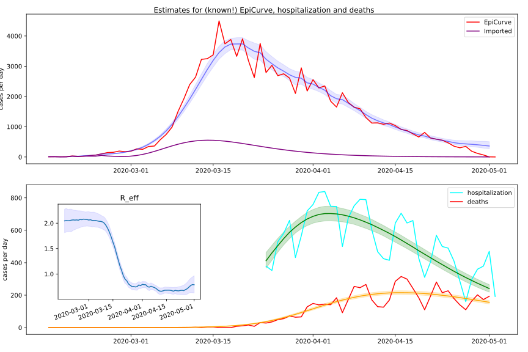
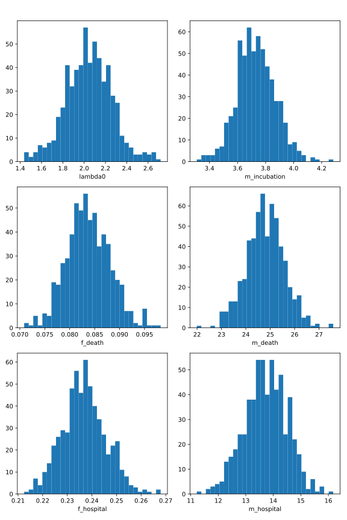

# COVID19_inference_alt
[](https://www.gnu.org/licenses/gpl-3.0)
Alternate Model, based heavily on work done https://github.com/Priesemann-Group/covid19_inference 


## Overview
Changes:
* Store state vector of new infected of last days in new_day used by theano.scan. No taps used. Scalar multiply this vector by beta to get new infected cases
* User theano's conv2d to delay (+offst) by a distribution

```python
def new_day(lambda_at_t, imported_at_t, infected, beta, ):
    new = imported_at_t + theano.dot(infected,beta) * lambda_at_t * f
    infected = tt.roll(infected,1,0)
    infected = tt.set_subtensor(infected[:1],new,inplace=False)
```

```python
def conv_offset(inp,filt,amplitude=1,offset=0):
    zero = tt.zeros_like(inp)
    a0 = tt.concatenate((inp,zero,),0)
    a0r = tt.roll(a0,offset,0)
    a0rp = tt.set_subtensor(a0r[:offset],0.) * amplitude

    amplitude = tt.clip(amplitude,1e-12,1e9) # Limit to prevent NANs
    
    a0rp3d = tt.alloc(0.,1,a0rp.shape[0],1 )
    a0rp = tt.set_subtensor(a0rp3d[0,:,0],a0rp)
    filt3d = tt.alloc(0.,1,filt.shape[0],1 )
    filt = tt.set_subtensor(filt3d[0,:,0],filt)
    return tt_conv.conv2d(a0rp,filt,None,None,border_mode='full').flatten()
```

## Results
<p float="left">
	
</p>


<p float="left">
    
</p>